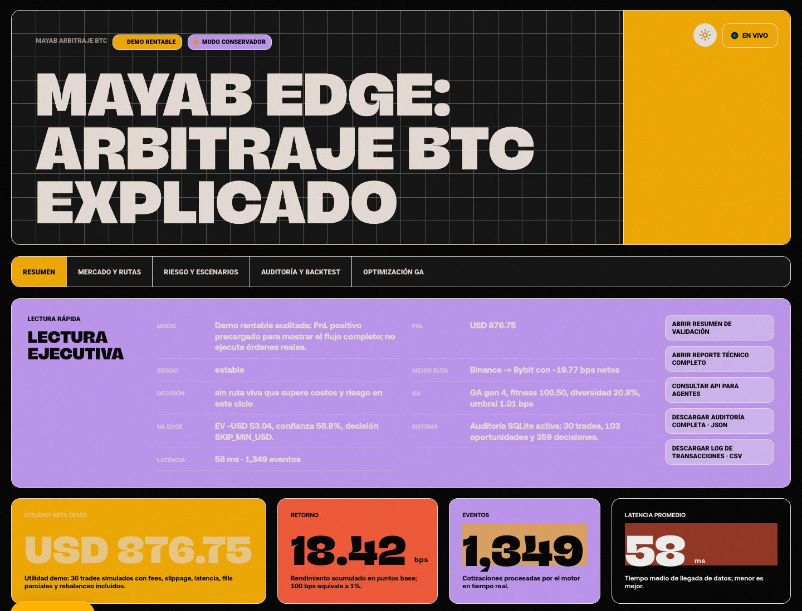
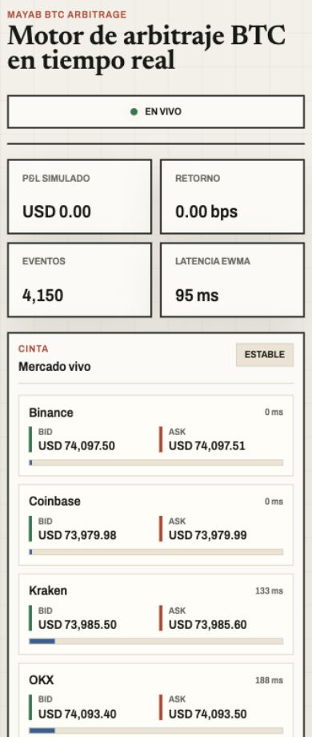

# Mayab Arbitraje BTC

[Aplicación pública en Cloud Run](https://mayab-btc-arbitrage-3erllnacaa-uc.a.run.app)

Mayab Arbitraje BTC es una aplicación web en Go para monitorear libros de órdenes de BTC en tiempo real, detectar arbitraje entre casas de cambio y simular ejecuciones con comisiones, deslizamiento, retiro amortizado, latencia y balances por cartera.

El sistema corre como un solo binario Go: conexiones WebSocket concurrentes, motor de decisión, simulador de carteras, API e interfaz embebida. Esa arquitectura reduce latencia operativa, simplifica el despliegue y permite demostrar el sistema en vivo sin una cadena pesada de servicios.

## Virtudes principales

- Cinco casas de cambio conectadas en paralelo: Binance, Kraken, Coinbase, OKX y Bybit.
- Evaluación de rutas compra-venta en cada ciclo, no solo comparación entre dos mercados fijos.
- Simulación realista con comisiones por casa, deslizamiento, retiro amortizado, riesgo de latencia, liquidez del mejor nivel del libro y balances por cartera.
- Órdenes parciales cuando la liquidez o el balance no cubren el tamaño objetivo.
- Tablero operativo en tiempo real con mapa de rutas, ganancia/pérdida, latencia, oportunidades y ejecuciones.
- Docker listo para correr sin instalar Go en la máquina evaluadora.

## Capturas





## Qué hace

- Conecta feeds públicos WebSocket de Binance, Kraken, Coinbase, OKX y Bybit.
- Normaliza compra, venta, cantidad disponible, marca de tiempo y latencia por casa.
- Evalúa todas las rutas compra-venta posibles entre casas de cambio.
- Calcula rentabilidad bruta y neta considerando comisiones, deslizamiento, retiro amortizado y riesgo de latencia.
- Simula ejecuciones parciales cuando no hay liquidez o balance suficiente.
- Mantiene carteras por casa y ganancia/pérdida acumulada.
- Expone un tablero web en tiempo real con mapa de rutas, tablas, balances y gráficas.

## Tecnologías utilizadas

- Go 1.26
- Goroutines y canales para feeds concurrentes
- Gorilla WebSocket para conexiones de mercado y transmisión al navegador
- HTML, CSS y JavaScript sin framework ni paso de compilación
- Canvas 2D para gráficas y mapa de arbitraje
- Docker y Docker Compose para ejecución reproducible

## Arquitectura

```text
cmd/mayab-arbitrage       entrada del binario
internal/mercado          conectores WebSocket por casa de cambio
internal/motor            analizador, simulador, carteras y métricas
internal/http             API, WebSocket local y servidor estático
internal/webui/web        interfaz embebida en el binario Go
```

El servidor mantiene una goroutine por casa de cambio y un ciclo de análisis. La interfaz recibe capturas de estado por `/tiempo-real` y puede consultar el estado completo en `/api/estado`.

## Ejecución rápida con Docker

Solo necesitas Docker:

```bash
./scripts/run.sh
```

O directamente:

```bash
docker-compose up --build
```

Abre:

```text
http://localhost:8080
```

## Ejecución local con Go

```bash
go mod download
go run ./cmd/mayab-arbitrage
```

Pruebas:

```bash
go test ./...
```

Compilación:

```bash
go build -trimpath -ldflags="-s -w" -o mayab-arbitrage ./cmd/mayab-arbitrage
```

## Configuración

Puedes ajustar el perfil de costos con variables de entorno:

```bash
MAX_OPERACION_BTC=0.18 \
MIN_UTILIDAD_USD=1.25 \
MIN_DIFERENCIAL_NETO_BPS=0.65 \
DESLIZAMIENTO_BPS=0.35 \
ENFRIAMIENTO_MS=1400 \
RETIRO_AMORTIZADO_BPS=0.12 \
PORT=8080 \
go run ./cmd/mayab-arbitrage
```

Comisiones por casa de cambio:

```bash
FEE_BINANCE=0.001
FEE_KRAKEN=0.0026
FEE_COINBASE=0.006
FEE_OKX=0.001
FEE_BYBIT=0.001
```

## Despliegue gratis

Render:

1. Sube este repositorio a GitHub.
2. En Render crea un nuevo servicio web desde el repositorio.
3. Render detecta `render.yaml`.
4. Usa el plan gratuito y espera el despliegue.

Fly.io:

```bash
fly launch --copy-config
fly deploy
```

Cloud Run:

```bash
gcloud run deploy mayab-btc-arbitrage \
  --source . \
  --region us-central1 \
  --allow-unauthenticated
```

## Endpoints

```text
GET /              tablero
GET /healthz       verificación de salud
GET /api/estado    captura JSON completa
WS  /tiempo-real   transmisión del estado en vivo
```

## Nota de seguridad

El sistema no opera dinero real ni usa llaves API privadas. Todas las operaciones son simuladas sobre datos públicos de mercado.
